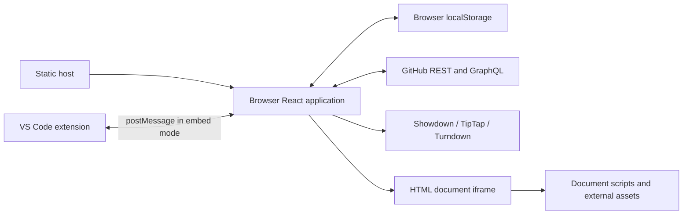

# Architecture

Reviewed against `4abb8f5` on 2026-09-23. MarDoc's core constraint is a browser-only application that can be served as static files, with no application backend required for document review.

## Runtime and hosting

[Next.js configuration](../next.config.js) sets `output: "export"`. The build produces `out/`, which the [deployment workflow](../.github/workflows/deploy.yml) publishes to GitHub Pages. React state and document processing run in the browser; no API routes or database are present. GitHub holds repository files, commits, PRs, and submitted discussions.



The diagram shows data paths, not security isolation guarantees. See [data and security](data-and-security.md) for the current HTML boundary.

## Code map

| Area | Main entry points |
| --- | --- |
| Page and shared state | [page.tsx](../src/app/page.tsx), [app-context.tsx](../src/lib/app-context.tsx) |
| Repository navigation and deep links | [Sidebar.tsx](../src/components/Sidebar.tsx), [hash-router.ts](../src/lib/hash-router.ts) |
| API operations and image reads | [github-api.ts](../src/lib/github-api.ts) |
| Markdown editing and serialization | [Editor.tsx](../src/components/Editor.tsx), [turndown.ts](../src/lib/turndown.ts) |
| PR review, polling, and pending comments | [PRDetail.tsx](../src/components/PRDetail.tsx), [review-fallback.ts](../src/lib/review-fallback.ts), [comment-merge.ts](../src/lib/comment-merge.ts) |
| Rendered diffs and source mappings | [DiffViewer.tsx](../src/components/DiffViewer.tsx), [diff-blocks.ts](../src/lib/diff-blocks.ts) |
| HTML viewing and selection bridge | [HtmlViewer.tsx](../src/components/HtmlViewer.tsx), [html-source-lines.ts](../src/lib/html-source-lines.ts), [html-selection.ts](../src/lib/html-selection.ts) |
| Diagrams and images | [mermaid.ts](../src/lib/mermaid.ts), [image-upload.ts](../src/lib/image-upload.ts), [image-path-config.ts](../src/lib/image-path-config.ts) |
| Persistence and resilience | [draft-store.ts](../src/lib/draft-store.ts), [safe-storage.ts](../src/lib/safe-storage.ts), [staleness-guard.ts](../src/lib/staleness-guard.ts), [rate-limit.ts](../src/lib/rate-limit.ts) |
| Extension messages | [embed-image-bridge.ts](../src/lib/embed-image-bridge.ts), [embed-reload.ts](../src/lib/embed-reload.ts), [open-external.ts](../src/lib/open-external.ts) |

## Loading and review flow

Connecting initializes a module-level Octokit client. Repository selection loads the default branch, recursive tree, PR list, and branch list. These stages currently contain serial waits and repeated metadata reads. PR document counts are enriched asynchronously through GraphQL.

Opening a PR starts file and comment loading together. `fetchPRFiles` requests the changed-file list and PR metadata, then fetches each document's base and head contents sequentially. The review waits for both file and comment results. PR file/comment list reads currently stop at one page of 100; individual content failures become empty strings. These are known correctness and performance gaps, not intended guarantees.

`DiffViewer` aligns Markdown blocks and computes word differences. Source-line ranges and selected text flow into pending review comments. HTML selection uses injected line attributes and an iframe message. `PRDetail` owns the local pending queue and submits it through `submitReviewBatched`; fallback behavior can post separate comments. Existing comments are refreshed on a 30-second interval and after writes.

Generation guards discard stale results for several repository/file/PR loads. PR-list loading and count enrichment do not yet have equivalent end-to-end protection.

## Rendering and editing

Markdown flows through Showdown into HTML. The rich editor uses TipTap's schema; Turndown serializes its HTML back to Markdown. Diagram source and original image URLs have dedicated preservation rules. This is a normalization pipeline with known losses, not a lossless source editor. Code view maintains a Markdown string while active.

Standalone HTML routes to `HtmlViewer`, while HTML PRs use a separate path in `DiffViewer`. Both use iframe `srcdoc` with injected resize and selection scripts. HTML viewing does not use TipTap editing. Mermaid is dynamically imported for Markdown rendering; document-provided HTML scripts have their own loading behavior.

## Navigation

Hash routing keeps all URLs on the static application shell:

```text
/#/owner/repo
/#/owner/repo/blob/main/docs/guide.md
/#/owner/repo/pull/42
/#/owner/repo/pull/42/files/1
```

PR file indices are zero-based. Hash state takes precedence over the saved repository at startup. The parser decodes branch/path segments, but route builders do not encode them; branches containing slashes and malformed escapes/numeric segments need further handling. See [known issues](known-issues.md).

## Embed contract

The browser application supports messages for initialization, theme, external links, file saves, image reads, and content reload. The actual external-link message is `open-external`. Reload uses `file:reload` → `file:content`; watcher updates can carry `reason: "watch"`. The app checks the target path and can reject watcher updates when the editor is dirty, subject to the current dirty-state limitations for local files.

The separate extension owns filesystem access and message forwarding. App-side support and unit tests do not establish that a particular extension version implements the other half of the protocol.

## Performance work

Start with production-export measurements: time to repository navigation, first readable PR file, file switching, typing response, long tasks, and API counts. Compare cold/warm loads, slow connections, large documents, and mobile. Source-level candidates include selected-file-first loading, bounded concurrency, immutable-content caching, rendering work, and polling coalescing. None has a measured speedup yet. Track work in [known issues](known-issues.md).
